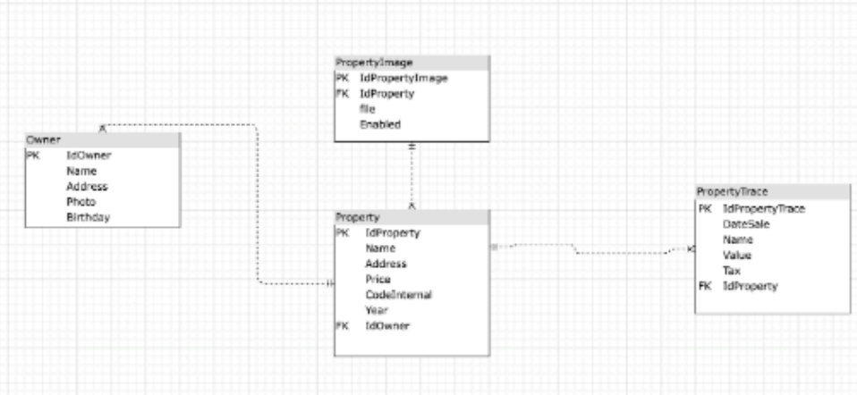

# TECHNICAL TEST SR DEVELOPER .NET

<strong>Required manage</strong>
- .NET 5 o superiores
- SQL Server
- C#
- nUnit

<strong>For the practical exercise, take into account the following evaluation criteria:</strong>

- Architecture
- Structure
- Documentation Code
- Best Practices
- Manage Performance
- Unit Test
- Security

<strong>A large Real Estate company requires creating an API to obtain information about properties in
the United States, this is in a database as shown in the image, its task is to create a set of
services:</strong>

- Create Property Building
- Add Image from property
- Change Price
- Update property
- List property with filters

<strong>Note: Complete data type depend on your criteria and add field according for your
consideration.</strong>

