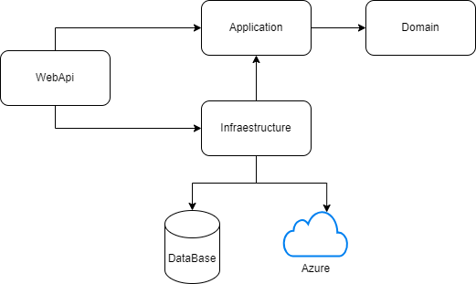
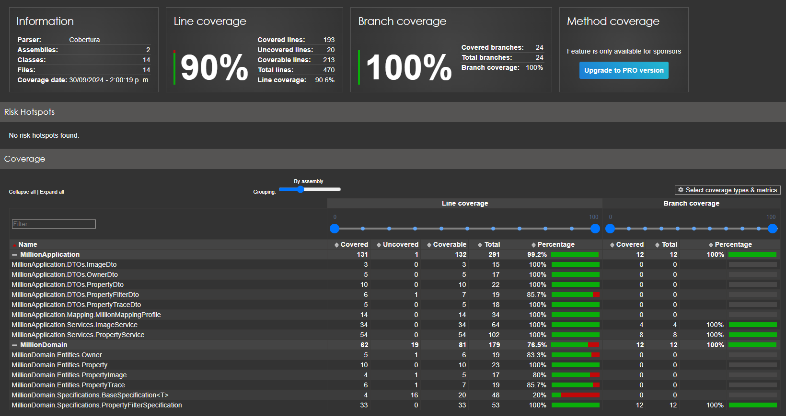
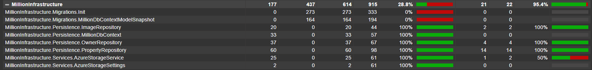
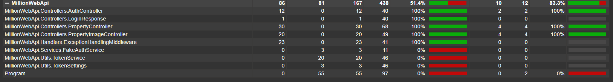

# TECHNICAL TEST SR DEVELOPER .NET

<strong>Required manage</strong>

-   .NET 5 o superiores
-   SQL Server
-   C#
-   nUnit

<strong>For the practical exercise, take into account the following evaluation criteria:</strong>

-   Architecture
-   Structure
-   Documentation Code
-   Best Practices
-   Manage Performance
-   Unit Test
-   Security

<strong>A large Real Estate company requires creating an API to obtain information about properties in
the United States, this is in a database as shown in the image, its task is to create a set of
services:</strong>

-   Create Property Building
-   Add Image from property
-   Change Price
-   Update property
-   List property with filters

<strong>Note: Complete data type depend on your criteria and add field according for your
consideration.</strong>

---

## Solution Summary

When developing this test take the following considerations into account:

-   The PropertyTrace table stores property sales information and is not related to the creation or update of properties.
-   -when updating the property you can update all the fields except the price for this you have another api enabled.
-   when listing the properties you will only see the Property fields and the Trace, Images or Owner data will be empty to improve the performance, to see this data you must query the property by Id (`/api/property/859`).
-   The query with property filter filters by OwnerName, InternalCode, MinPrice, MaxPrice, Address and Year, but the service can be extended to apply paging using PropertyFilterSpecification.

## Important for running the API

Inside the `Resources` folder you will have a script to generate the database (`script.sql`), a backup file (`file.bacpac`) and the postman collection (`Million.postman_collection.json`) for the requests these include the authentication (`/login`) which triggers the token obtained in the other requests.

#### Security

Apis require to have a token in the requests this token is generated with the `/login` api, you must send email and password in the body (see **Million.postman_collection.json**) it will response a token with any value of Email and password.

For Example:

<code> curl --location 'https://localhost:7079/api/Auth/login' \
--header 'Content-Type: application/json' \
--data '{
"email": "test",
"password": "asdasd"
}'</code>

#### Block diagram

#### Test Result

**MillionApplication.Tests**

**MillionInfraestructure.Tests**

**MillionWebApi.Tests**

